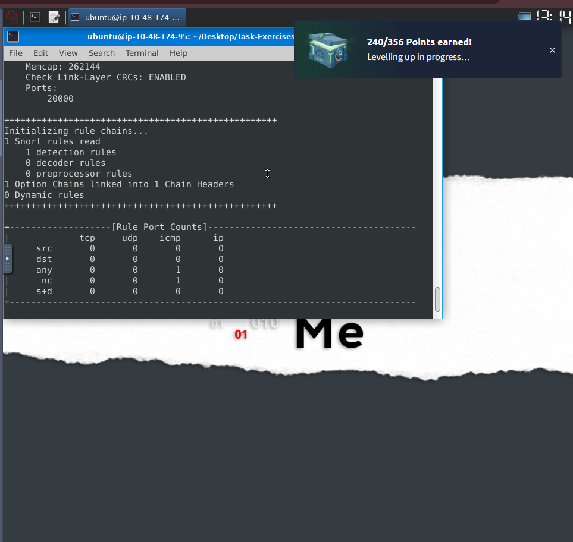
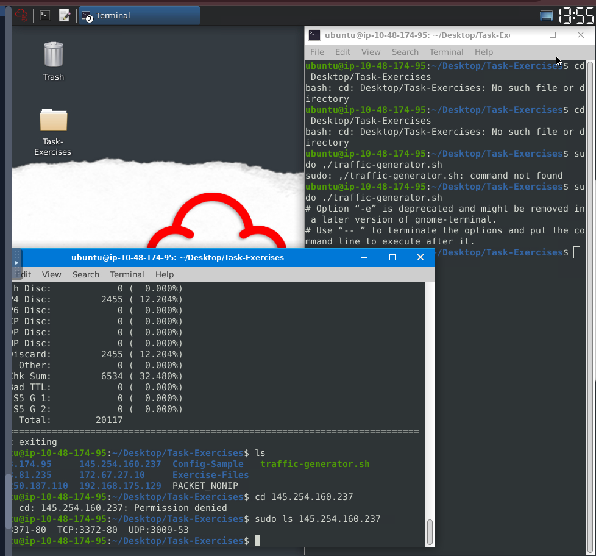
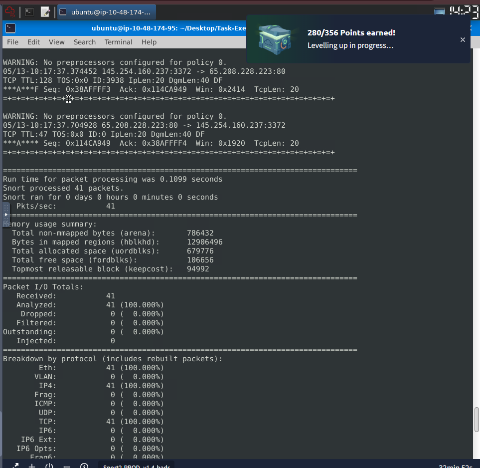

# Network Intrusion Detection/Prevention System (NIDS/NIPS): Snort

ส่วนนี้ของโปรเจกต์เป็นการเจาะลึกการใช้งาน **Snort** ซึ่งเป็นเครื่องมือ NIDS/NIPS แบบ Open-source ที่ได้รับความนิยมสูงสุดในสายงาน Security Operations Center (SOC) เพื่อการเฝ้าระวังและป้องกันภัยคุกคามในระดับเครือข่าย

---

## 1. IDS vs IPS Architecture & Concepts
ก่อนการปรับใช้เครื่องมือ สิ่งสำคัญคือการทำความเข้าใจสถาปัตยกรรมและวิธีการตรวจจับของระบบความปลอดภัย:

### 🛡️ Deployment Types (ประเภทการติดตั้ง)
* **IDS (Intrusion Detection System):** ระบบตรวจจับแบบ Passive ทำหน้าที่วิเคราะห์และแจ้งเตือน (Alert) เมื่อพบความผิดปกติ แต่จะไม่เข้าไปแทรกแซงการเชื่อมต่อ
* **IPS (Intrusion Prevention System):** ระบบป้องกันแบบ Active ทำหน้าที่ตรวจจับและยุติการเชื่อมต่อ (Drop/Terminate) ทันทีเพื่อป้องกันความเสียหาย
* **NIDS / NIPS (Network-based):** ติดตั้งเพื่อเฝ้าระวังทราฟฟิกในภาพรวมของทั้งเครือข่าย (Subnet/Network)
* **HIDS / HIPS (Host-based):** ติดตั้งบนเครื่อง Endpoint เพื่อเฝ้าระวังพฤติกรรมเฉพาะเครื่องนั้นๆ

### 🔍 Detection Techniques (เทคนิคการตรวจจับ)
1.  **Signature-Based:** ตรวจจับโดยอาศัย "รูปแบบที่รู้จักแล้ว" (Known threats) ทำงานรวดเร็ว แม่นยำ แต่ไม่สามารถป้องกันภัยคุกคามใหม่ๆ (Zero-day) ได้
2.  **Behavior-Based (NBA - Network Behavior Analysis):** ตรวจจับจาก "ความผิดปกติ" (Anomaly) โดยระบบต้องใช้เวลาเรียนรู้พฤติกรรมปกติของเครือข่ายเสียก่อน (กระบวนการนี้เรียกว่า **Baselining**)
3.  **Policy-Based:** ตรวจจับจากการละเมิดนโยบายความปลอดภัยที่องค์กรกำหนดไว้

---

## 2. Snort Initial Configuration & Validation
ในการทำงานจริงของ Blue Team การตรวจสอบความถูกต้องของ Configuration File ถือเป็น Best Practice ที่ขาดไม่ได้ เพื่อป้องกันไม่ให้ระบบ NIDS ล่มเมื่อนำไปรันบน Production

**Basic Operational Commands:**
* `snort -V` : ตรวจสอบเวอร์ชันและ Build number ของระบบ
* `snort -c <config_file> -T` : ทดสอบ (Test) ไฟล์ Configuration ว่าเขียน Rule ถูกต้องตามไวยากรณ์หรือไม่ ก่อนเริ่มการทำงานจริง
* `snort -q` : โหมด Quiet ลดการแสดงผล Banner เพื่อให้หน้าจอ Console สะอาดและง่ายต่อการอ่าน Log

**Example of Configuration Validation:**
```bash
# การทดสอบไฟล์ snort.conf เพื่อเช็กจำนวน Rule ที่โหลดสำเร็จและค้นหา Syntax Error
sudo snort -c /etc/snort/snort.conf -T

# Output Snippet:
# Snort successfully validated the configuration!
# Snort rules read: 4151## 3. Snort Operation Modes: Sniffer Mode (Task 5)
นอกเหนือจากการทำงานเป็น NIDS/NIPS แล้ว ขีดความสามารถพื้นฐานของ Snort คือการทำตัวเป็น **Packet Sniffer** (คล้ายคลึงกับ `tcpdump` หรือ `Wireshark` ในรูปแบบ Command Line) ซึ่งเป็นประโยชน์อย่างมากในการทำ Network Debugging หรือ Live Traffic Analysis บนเซิร์ฟเวอร์ที่ไม่มีหน้าต่าง GUI

**Sniffer Mode Parameters:**
การใช้งานโหมดนี้ Analyst สามารถเลือกระดับความละเอียดของการถอดรหัสแพ็กเก็ต (Packet Decoding) ได้ตามความต้องการในการสืบสวน:

* `-i <interface>` : ระบุ Network Interface ที่ต้องการดักจับ (เช่น `eth0`) หากไม่ระบุ Snort จะเลือก Interface หลักให้โดยอัตโนมัติ
* `-v` (Verbose) : แสดงข้อมูลระดับ Header ของ TCP/IP/UDP/ICMP (เหมาะสำหรับการดูว่าใครคุยกับใคร พอร์ตอะไร)
* `-d` (Dump payload) : แสดงข้อมูลในส่วนของ Application Data / Payload เพิ่มเติมจาก Header
* `-e` (Ethernet/Link-layer) : แสดงข้อมูล Data Link Layer Header (เช่น MAC Address) 
* `-X` (Full Packet Dump) : แสดงข้อมูลแพ็กเก็ตแบบเต็มรูปแบบ พร้อมแปลงข้อมูลเป็น Hexadecimal (ฐาน 16) ควบคู่กับ ASCII ซึ่งเป็นโหมดที่สำคัญมากในการทำ **Malware Analysis** หรือตรวจหา Payload ที่ถูก Obfuscate มา

**Example Usage & Output Analysis:**
```bash
# การดักจับแพ็กเก็ตแบบเจาะลึก (Full Dump) บน Interface eth0
sudo snort -X -i eth0

# -- Analytical Note --
# ในการทำ Incident Response หากพบว่ามีการเชื่อมต่อที่น่าสงสัย 
# Analyst จะใช้พารามิเตอร์ -X เพื่อแกะดู Payload ภายใน 
# ว่ามีการส่งคำสั่งแบบ Plain-text หรือมีการซ่อน Malicious Script ไว้หรือไม่
## 4. Snort Operation Modes: Packet Logger Mode (Task 6)
ในการมอนิเตอร์เครือข่ายตลอด 24 ชั่วโมง Analyst ไม่สามารถนั่งดูทราฟฟิกแบบ Real-time ได้ตลอดเวลา Snort จึงมีโหมด **Packet Logger** เพื่อบันทึกข้อมูลแพ็กเก็ตลงฮาร์ดดิสก์สำหรับการทำ Offline Analysis, Incident Response หรือ Digital Forensics ในภายหลัง

**Logger Mode & Read Parameters:**
* `-l <directory>` : กำหนดโฟลเดอร์ปลายทางสำหรับจัดเก็บไฟล์ Log (เช่น `-l .` หมายถึงบันทึกในโฟลเดอร์ปัจจุบัน)
* `-K ASCII` : ปรับฟอร์แมตการบันทึกให้อยู่ในรูปแบบที่มนุษย์อ่านได้ (Human-readable) โดย Snort จะสร้างโฟลเดอร์แยกตาม IP Address อัตโนมัติ ทำให้ง่ายต่อการสืบสวนรายเครื่อง
* `-r <logfile>` : (Read Mode) สั่งให้ Snort เปิดอ่านไฟล์ Log หรือไฟล์ `.pcap` ที่บันทึกไว้
* `-n <number>` : ระบุจำนวนแพ็กเก็ตที่ต้องการอ่าน (จำกัดปริมาณข้อมูลเพื่อไม่ให้หน้าจอรกจนเกินไป)
* **BPF (Berkeley Packet Filter):** สามารถต่อท้ายคำสั่งด้วย BPF Syntax เพื่อกรองเฉพาะโปรโตคอลหรือพอร์ตที่สนใจได้

**Example Usage & Offline Analysis:**
```bash
# 1. การเปิดโหมดดักจับและบันทึก Log แยกตาม IP Address (โหมดซ่อนตัว/Quiet)
sudo snort -dev -K ASCII -l . -q

# 2. การอ่านไฟล์ Log ย้อนหลัง โดยกรองดูเฉพาะ 10 แพ็กเก็ตแรก
snort -r snort.log.1640048004 -n 10

# 3. การทำ Deep Packet Inspection อ่านไส้ใน (Payload) ของแพ็กเก็ตที่ 4
snort -r snort.log.1640048004 -n 4 -X

# 4. การประยุกต์ใช้ BPF Filter กรองดูเฉพาะทราฟฟิก TCP Port 80 (HTTP)
snort -r snort.log.1640048004 tcp port 80


