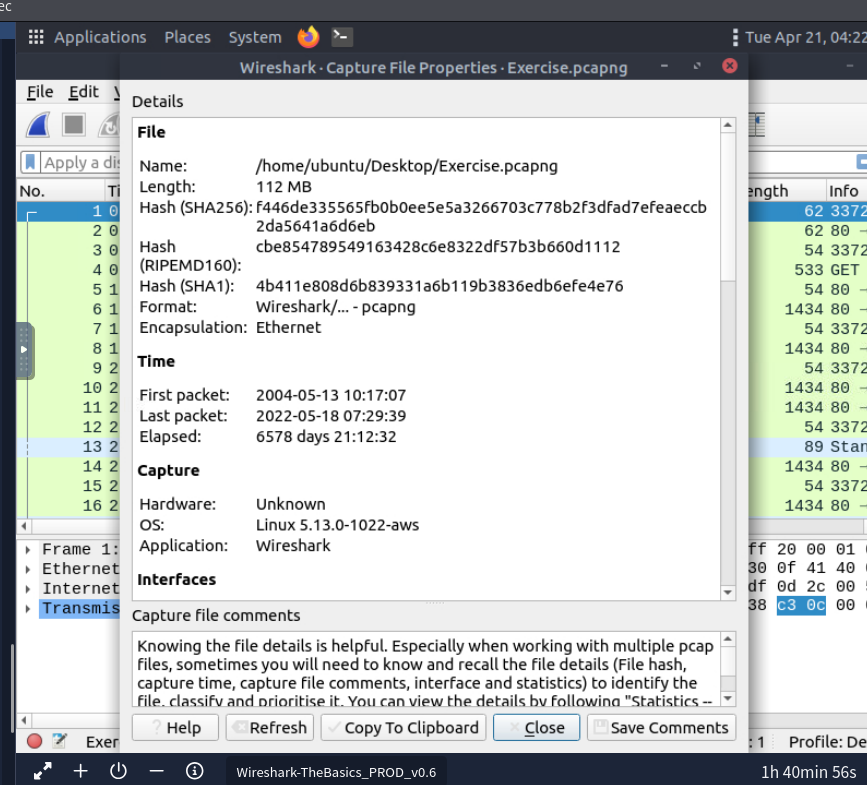
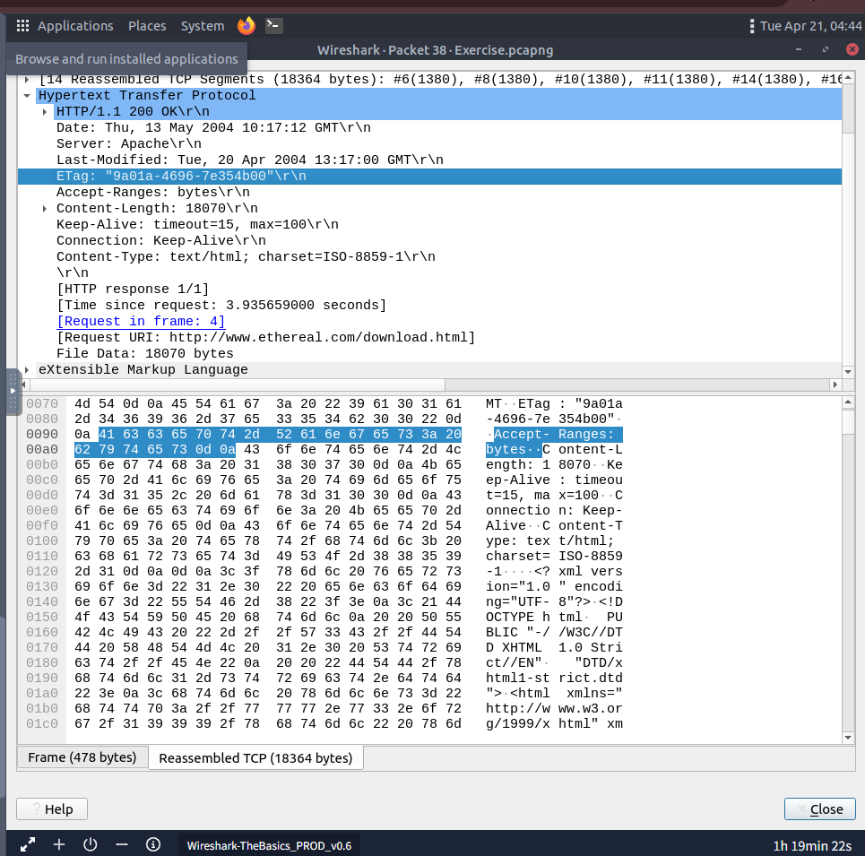
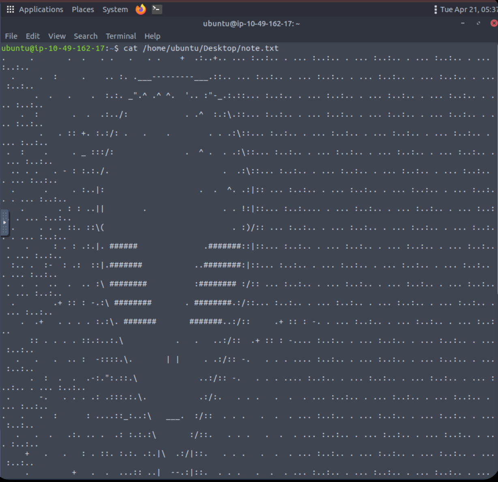
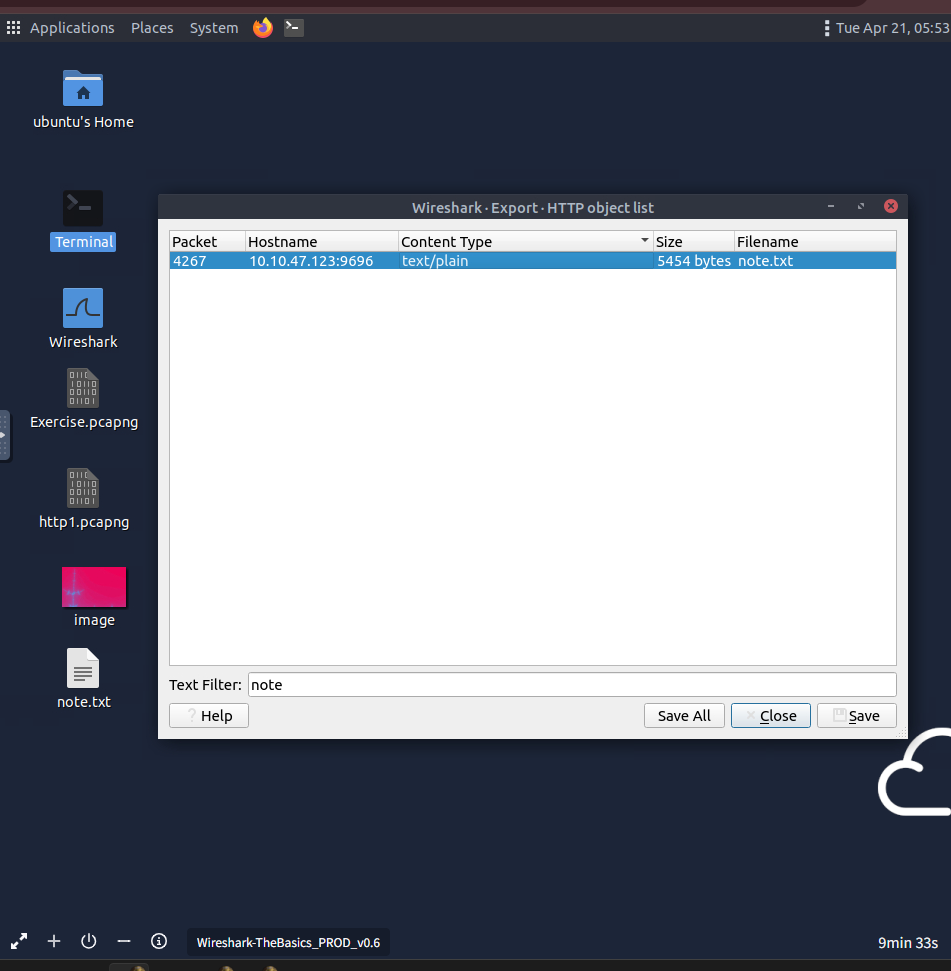
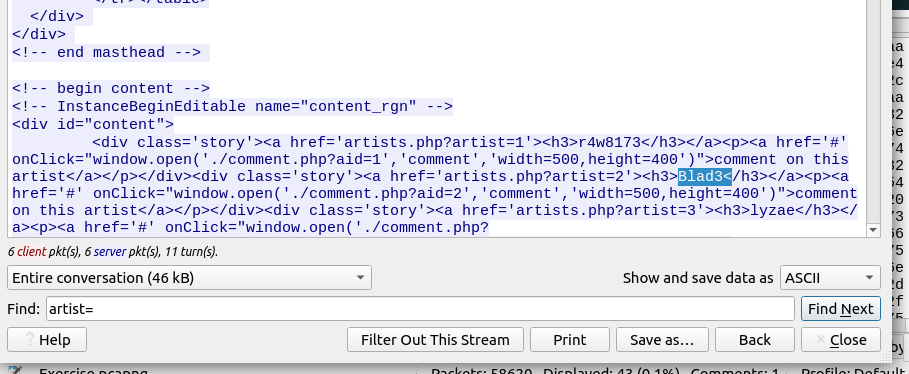
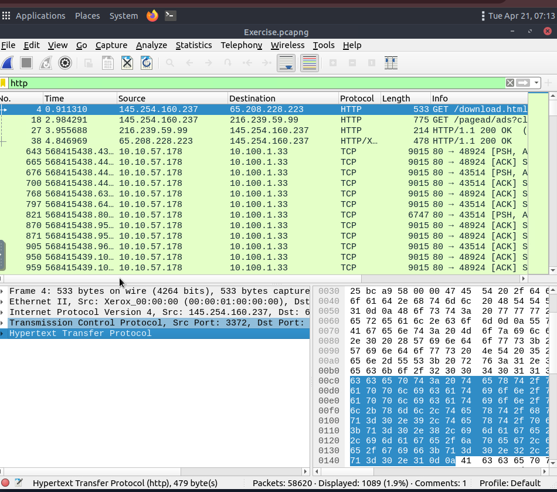

# Wireshark: The Basics

**Objective:** เรียนรู้พื้นฐานการใช้งาน Wireshark ซึ่งเป็น Network Packet Analyser Tool ระดับโลก เป้าหมายคือการนำเข้าไฟล์ Packet Capture (.pcapng) เพื่อทำ Packet Inspection ดูการทำงานของ TCP/IP Layers และการใช้ Display Filters เพื่อคัดกรองข้อมูลที่ต้องการวิเคราะห์

**Tool Used:** Wireshark

### Task 2: Tool Overview & File Details
ในการเริ่มต้นทำ Incident Response จากไฟล์ PCAP สิ่งแรกที่ควรทำคือการตรวจสอบ **Capture File Properties** เพื่อรักษาความน่าเชื่อถือของหลักฐาน (Chain of Custody):
- ตรวจสอบ `SHA256 Hash` ของไฟล์ Capture เพื่อยืนยันความถูกต้องของข้อมูล (Integrity)
- ตรวจสอบจำนวน Packets ทั้งหมดและระยะเวลาที่ Capture เพื่อประเมินสโคปของ Incident
- **Wireshark GUI Framework:** การสืบสวนจะทำผ่าน 3 ส่วนหลักคือ Packet List (ภาพรวม), Packet Details (วิเคราะห์ Protocol Header), และ Packet Bytes (วิเคราะห์ Hex/ASCII Payload)

### Task 3: Packet Dissection & OSI Model Application
ctrl + g find port
ในการวิเคราะห์เชิงลึก (Deep Packet Inspection) Wireshark จะทำการชำแหละ Packet ตามโครงสร้างของ OSI Model ผมได้ทำการวิเคราะห์ Packet ลำดับที่ 38 และสามารถ Map ข้อมูลเข้ากับแต่ละ Layer ได้ดังนี้:
- **Layer 1 (Frame):** ตรวจสอบ `Arrival Time` เพื่อทำ Timeline Analysis ระหว่างเกิด Incident
- **Layer 3 (Network):** ตรวจสอบ `TTL (Time to Live)` ซึ่งเป็นประโยชน์ในการทำ OS Fingerprinting เพื่อคาดเดาระบบปฏิบัติการของต้นทาง
- **Layer 4 (Transport):** สามารถดึงขนาดของ `TCP Payload Size` ได้
- **Layer 7 (Application):** สามารถเจาะลึกเข้าไปดูเนื้อหาของ Protocol HTTP ทำให้เห็นประเภทของภาษา (`eXtensible Markup Language`) และ `E-Tag` สำหรับตรวจสอบ Web Cache

### Task 4: Advanced Search & Object Extraction
ในสถานการณ์ที่มี Packet จำนวนมหาศาล การค้นหาแบบเจาะจงมีความสำคัญมาก:
- **Search Capabilities:** สามารถใช้ฟังก์ชัน Find Packet ร่วมกับเงื่อนไข `String` ในการค้นหา Keywords เฉพาะ (เช่น IOCs หรือชื่อไฟล์) ภายใน `Packet Details` ได้อย่างรวดเร็ว
- **Expert Information:** ใช้เครื่องมือนี้เป็นเหมือน IDS ขนาดย่อมในการทำ Alert Triage เบื้องต้น เพื่อดึงสถิติของ `Errors` และ `Warnings` มาจัดลำดับความสำคัญในการสืบสวน
- **File Extraction (Export Objects):** นี่คือเทคนิคสำคัญในการทำ Malware Analysis โดยสามารถสกัดไฟล์ที่แนบมากับโปรโตคอล (เช่น HTTP) ออกมาเป็นไฟล์ต้นฉบับ เพื่อนำไปคำนวณหาค่า MD5 Hash ยืนยันตัวตน หรือทำ Static Analysis ต่อไป

### Task 5: Packet Filtering & Stream Analysis
การจัดการกับ Traffic ปริมาณมหาศาลต้องใช้เทคนิคการ Filtering เพื่อตัด Noise ออก:
- **Display Filters:** ผมสามารถใช้คำสั่ง Filter เบื้องต้น (เช่น `http`, `tcp.port == 80`, `ip.addr == 192.168.1.2`) หรือใช้ฟังก์ชัน `Apply as Filter` จาก GUI เพื่อคัดกรองเฉพาะ Protocol ที่สนใจได้ ซึ่งช่วยลดระยะเวลาในการวิเคราะห์ลงอย่างมาก
- **Follow Stream (TCP/HTTP):** ในกรณีที่ต้องการประกอบร่าง Packets กลับไปเป็นข้อมูลระดับ Application ผมใช้ฟังก์ชัน Follow Stream เพื่อวิเคราะห์ HTTP Request/Response แบบเต็มรูปแบบ ทำให้สามารถอ่าน Data หรือ Source Code ของเว็บเพจที่ถูกส่งผ่านเครือข่ายได้โดยตรง (เช่น การดึงรายชื่อ Artists ออกมาจากหน้าเว็บ)

